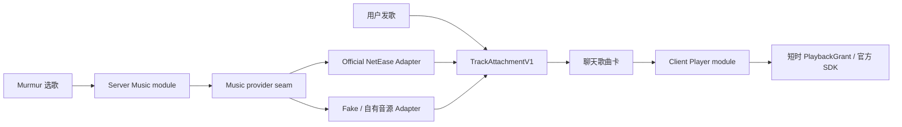

# 网易云音乐非官方播放与网页嵌入可行性（2026-08-30）

> 状态：调研结论，不是实现授权｜适用：Murmur 内直接播放网易云与网页承载的可行性｜核验：2026-08-30（Asia/Shanghai）｜依据：2026-08-30 本次现场响应与一手官方文档
> 范围：Murmur 内直接播放网易云音乐，或在 `WKWebView` / Android `WebView` / iframe 中承载网易云网页；不研究或指导绕过登录、付费、地域、版权或风控限制。
> 事实标签：**已证实**表示有本次现场响应或一手文档；**推断**表示基于平台机制的工程判断；**未知**表示仍需网易云书面确认或真机验证。

## 结论摘要

1. **网页层面当前能嵌。** 网易云单曲页和歌单页仍提供“生成外链播放器”，生成官方 `outchain/player` iframe。2026-08-30 现场检查的单曲、歌单、外链播放器和 Web player 最终响应均未返回 `X-Frame-Options`，CSP 也没有 `frame-ancestors`，因此当前不会被这两项浏览器策略阻止。
2. **能嵌不等于能作为 App 的稳定音乐能力。** 外链播放器依赖网易云网站的未公开内部接口、曲目版权状态、登录/Cookie 和网页实现；没有移动 SDK、状态回调、SLA 或兼容性承诺。响应头、页面结构和可播性都可随时改变。
3. **官方 iframe 是网页嵌入意图的证据，但不是 App 商用/分发授权。** 网易云服务条款禁止未经授权的兼容软件、插件、客户端交互数据利用和逆向；Apple 也可要求第三方流媒体授权证明。上线硬闸门是网易云的书面许可，不是 PoC 能否播放。
4. **非官方 API / 第三方播放器不建议进入生产。** Binaryify 原仓库已归档并明确写“保护版权，此仓库不再维护”；活跃增强版明确感谢对 `eapi`、`weapi`、`xeapi` 加密算法的逆向，YesPlayMusic 则依赖这类 API。MIT 只许可代码，不许可网易云账号、接口、录音制品或曲库。
5. **弱化版推荐路线：** 若目标只是分享歌曲，首版可做“粘贴公开分享链接 → 展示歌曲卡片 → 用户点击后交给网易云 App/系统浏览器”，不登录、不抓播放地址、不注入 JS；官方外链播放器仅可做隔离 PoC。
6. **完整目标的更新结论：** 登录音乐账号、Murmur 与用户双向发送结构化歌曲、并在 Murmur 内播放，必须取得网易云厂商 OAuth、曲目/账户 scope、播放 URL 或 SDK 及书面内容授权。网易云正式平台的能力形状可能覆盖这些需求，但 Murmur 当前没有获批权限，因此目前是 **No-Go**；外链、Cookie 和非官方 API 均不能替代。

## 方案结论矩阵

| 方案 | 技术可行性 | 稳定性 | 账号/版权风险 | 上架判断 | 结论 |
| --- | --- | --- | --- | --- | --- |
| 网易云正式厂商 OAuth/API/SDK | 能力形状上可能覆盖登录、目录与播放 | 取决于获批 scope、SDK 与 SLA | 可由合同和正式授权控制 | 有机会提供完整审核材料 | **尚未获批；商务签约后条件 Go** |
| 官方 `outchain/player` iframe，无登录、`auto=0` | 当前可加载；官方页面会生成 iframe | 低到中；网页和私有接口均可变 | 中到高；未找到 App 分发授权 | Apple 可能要求第三方内容授权 | **仅 PoC；上线前书面许可** |
| 在 WebView 打开完整单曲/歌单/Web player | 顶层加载通常可行 | 低；导航、广告、登录、跳 App 不受控 | 高；易成为网页套壳，Cookie/隐私面扩大 | Apple 4.2 与 5.2 风险 | **No-Go** |
| iframe/WebView 内登录网易云 | 技术上可能，但跨站 Cookie、验证码、设备风控待真机核验 | 低 | 很高；账号凭据、隐私、风控与授权责任 | 需审核账号；授权证明仍是核心 | **No-Go** |
| 调用/自建 Binaryify、Enhanced、YesPlayMusic 类接口 | 社区实现丰富 | 低；依赖逆向协议和用户 Cookie | 极高；违反条款与版权风险 | 难以向商店证明授权 | **No-Go** |
| 直接使用 `/song/media/outer/url` MP3 外链 | 个别公开样本当前可播 | 极低；短时地址、曲权和重定向链均可变 | 高；没有面向第三方 App 的播放授权 | ATS/混合内容与 Apple 5.2 风险 | **No-Go** |
| 从分享页解析 `<audio>`、抓取实际音频 URL | 某些时刻可能成功 | 极低；测试样本匿名取址返回不可播 | 极高；属于未授权提取/重放风险 | Apple 5.2.2/5.2.3 高风险 | **No-Go** |
| 公开分享链接 → 外部网易云 App/浏览器 | 高 | 中到高；只依赖公开 URL | 低到中；不在 Murmur 内再分发音频 | 通常比内嵌流媒体清晰 | **Go，推荐 MVP** |
| 用户本地文件 | 高 | 高 | 低；前提是用户自行选择且不上传/再分发 | 常规本地媒体能力 | **Go** |
| 自有、免版税或已签约曲库 | 高 | 高 | 可通过合同控制 | 可提供权利链证明 | **Go** |
| Apple MusicKit | 高；有 iOS/Android/Web 官方 SDK/API | 高于网页逆向 | 需用户授权、订阅和 Apple 条款合规 | 有正式审核路径 | **条件 Go** |

## 1. 网易云网页与官方外链播放器

### 1.1 现场响应头

2026-08-30 使用浏览器 UA、跟随重定向检查以下 URL：

- [单曲页](https://music.163.com/song?id=186016)
- [歌单页](https://music.163.com/playlist?id=3778678)
- [单曲外链播放器](https://music.163.com/outchain/player?type=2&id=186016&auto=0&height=66)
- [歌单外链播放器](https://music.163.com/outchain/player?type=0&id=3778678&auto=0&height=430)
- [Web player](https://music.163.com/st/webplayer)

**已证实：** 五个最终响应均为 HTTP 200 HTML；CSP 只有 `upgrade-insecure-requests`，未返回 `X-Frame-Options`，CSP 中也没有 `frame-ancestors`。这说明截至检查时，浏览器 framing 机制不阻止嵌入。它不是长期契约，服务端可以即时更改。

### 1.2 是否存在官方可嵌 HTML

**已证实：** 单曲页与歌单页分别存在“生成外链播放器”入口，指向：

- [单曲外链生成页](https://music.163.com/outchain/2/186016/)
- [歌单外链生成页](https://music.163.com/outchain/0/3778678/)

生成页当前给出的代码是指向 `//music.163.com/outchain/player?...` 的 iframe；播放器脚本中还有面向 iframe 容器调整高度的逻辑。因此网易云确实保留了官方网页外链播放器，而非只能靠第三方模拟。

**边界：**

- 生成代码使用 scheme-relative URL。若 PoC 宿主是 App 内本地页，应明确使用 `https://music.163.com/...`，不要从 `file:` 继承协议。
- 外链播放器页面调用网易云网站内部路径，例如播放器 URL、歌曲和歌单详情接口；它们不是公开 SDK/API。允许加载官方页面不等于允许截获、重放或在原生层直接调用这些接口。
- 本次匿名测试曲目虽然有公开单曲页，但播放器 URL 请求返回 `url: null` 和不可听原因。**公开页面或分享链接存在，不保证匿名用户可获得可播音频。** 会员、付费、地域、下架、版权到期及风控都可能改变结果。
- 未找到网易云面向第三方 App 的 OAuth、Music SDK、原生播放控制或当前外链播放器商用授权说明。官方开发者 FAQ 对个人应用只开放 `ncm-cli`，并说明不是直接 API：[网易云音乐开放平台 FAQ](https://developer.music.163.com/st/developer/document?docId=3b75ab8e475d41ca93d91ebd4dfd383f)。

### 1.3 iframe、WKWebView 与 Android WebView 边界

| 问题 | 已证实事实 | 工程判断 / 未知项 |
| --- | --- | --- |
| iframe 是否被页面头阻止 | 本次无 XFO、无 CSP `frame-ancestors` | **当前可行，随时可变** |
| JavaScript | Android WebView 的 JS 默认关闭；播放器依赖 JS：[WebSettings](https://developer.android.com/reference/android/webkit/WebSettings#setJavaScriptEnabled(boolean)) | Android PoC 必须只对受信任 HTTPS 页面开启 |
| DOM Storage | Android 默认关闭：[WebSettings](https://developer.android.com/reference/android/webkit/WebSettings#setDomStorageEnabled(boolean)) | 登录/播放器可能依赖；开启会扩大持久数据面 |
| Cookie | WKWebView 由自己的 [`WKHTTPCookieStore`](https://developer.apple.com/documentation/webkit/wkwebsitedatastore/httpcookiestore) 管理；Android WebView 有独立 [`CookieManager`](https://developer.android.com/reference/android/webkit/CookieManager.html) | 不能假定自动复用 Safari/Chrome/网易云 App 登录态 |
| 第三方 Cookie | Android target Lollipop+ 的 WebView 默认不接受第三方 Cookie | Murmur 自有页中的网易云 iframe 比顶层网易云 WebView 更易丢登录态 |
| 自动播放 | Android `setMediaPlaybackRequiresUserGesture` 默认 `true`；WKWebView 有 `mediaTypesRequiringUserActionForPlayback` | 首版必须 `auto=0` 并要求用户手势；不要以关闭平台保护换“自动陪听” |
| 混合内容 | Android Lollipop+ 有混合内容限制，官方建议不放宽 | 全链路 HTTPS；不要启用 `MIXED_CONTENT_ALWAYS_ALLOW` |
| DRM | 本次未发现可作为承诺的 DRM 文档或稳定媒体格式 | **未知。** 不应把能在一个样本播放推断为所有曲目无 DRM、可抽取 |
| 跳 App/导航 | 网页存在外链、登录与 App 导流能力 | iOS universal link、自定义 scheme、Android intent 的行为需真机逐项拦截和 allowlist |
| 播放状态/曲目控制 | 官方外链播放器未提供面向宿主 App 的公开控制 SDK/回调 | 不注入 JS、不劫持请求时，Murmur 很难可靠获得当前曲目、进度与播放状态 |

Android 官方安全文档要求对 WebView 导航同时校验 scheme 与 host，并警告第三方内容上的原生 JS bridge 可导致代码/数据风险：[Unsafe URI loading](https://developer.android.com/privacy-and-security/risks/unsafe-uri-loading)、[Native bridges](https://developer.android.com/privacy-and-security/risks/insecure-webview-native-bridges)、[Unsafe file inclusion](https://developer.android.com/privacy-and-security/risks/webview-unsafe-file-inclusion)。因此 PoC 不应给网易云页面暴露 Murmur 原生 bridge，也不应开启 file/universal access。

### 1.4 旧版 MP3 外链的现场结果

网易云还保留形如 `https://music.163.com/song/media/outer/url?id=<歌曲 ID>.mp3` 的旧地址。2026-08-30 对公开样本 `110761` 的现场请求得到：

1. `music.163.com` 先返回 HTTP 302；
2. 跳转目标是带时效参数的 `http://m701.music.126.net/...mp3`；
3. 跟随跳转后，本次得到 HTTP 200、`audio/mpeg`，约 4.19 MB。

这证明“某个匿名公开样本此刻能下载/播放”，不证明该地址是公开 API，也不证明全部免费、会员、地域受限或已下架曲目可用。重定向目标使用明文 HTTP，会触及 iOS ATS 与 WebView 混合内容限制；短时地址、CDN host、参数和可播权限也都不是稳定契约。因此不应让 `AVPlayer` / Media3 直接依赖它，更不应代理、缓存或通过服务端批量解析。这里的判断是 **No-Go**，不是一条可实施的绕过方案。

## 2. 非官方 API 与开源播放器

### 2.1 项目状态

| 项目 | 截至 2026-08-30 的一手事实 | 协议/实现 | 判断 |
| --- | --- | --- | --- |
| [Binaryify/NeteaseCloudMusicApi](https://github.com/Binaryify/NeteaseCloudMusicApi) | GitHub 标记 archived；仓库 2024-04-16 归档，README 写“保护版权，此仓库不再维护”；GitHub API 显示最后 push 2024-02-28；归档壳未声明 license | 历史实现模拟网易云网页/客户端接口 | 官方停止信号明确，**No-Go** |
| [NeteaseCloudMusicApiEnhanced/api-enhanced](https://github.com/NeteaseCloudMusicApiEnhanced/api-enhanced) | 非归档，2026-08-28 仍有 push；仓库与 package 声明 MIT，README 称第三方 Node.js API / revival project | README 明确致谢对 `eapi`、`weapi`、`xeapi` 加密算法的逆向；接口包含登录、Cookie、播放 URL，甚至“解灰”相关依赖 | 维护活跃不降低合规风险，**No-Go** |
| “TH911 增强版”称呼 | 本次未在上述 canonical 仓库、组织页或 GitHub 仓库检索中核验到可归属 TH911 的官方维护身份 | **未知** | 不把个人昵称当项目授权主体；必须提供精确仓库 URL 后再核验 |
| [qier222/YesPlayMusic](https://github.com/qier222/YesPlayMusic) | 非归档，GitHub API 显示 2026-06-14 有 push，MIT；README 自称第三方网易云播放器，支持登录、私人 FM、每日推荐等；当前版本处于 maintenance mode，另有 2.0 alpha | 依赖 NeteaseCloudMusicApi 系生态；近期变更切换到增强 API | 可参考 UI/工程思路，不能证明网易云内容授权，**No-Go** |

增强版自身的 [README](https://github.com/NeteaseCloudMusicApiEnhanced/api-enhanced/blob/main/README.MD)、[类型接口](https://github.com/NeteaseCloudMusicApiEnhanced/api-enhanced/blob/main/interface.d.ts) 与 [package.json](https://github.com/NeteaseCloudMusicApiEnhanced/api-enhanced/blob/main/package.json) 共同证明它不是官方开放 SDK，而是维持私有协议兼容的第三方实现。YesPlayMusic 的 [README](https://github.com/qier222/YesPlayMusic/blob/master/README.md) 也明确其第三方播放器定位。

### 2.2 为什么 MIT 仍不能用来上线

MIT 解决的是仓库作者对**代码著作权**的许可，不会自动授予：

- 网易云商标与 UI 资产使用权；
- 网易云账号认证、Cookie 或私有接口使用权；
- 歌曲、录音制品、歌词、封面和会员内容的公开传播权；
- 绕过地域、会员、试听、下架或风控限制的权利。

网易云[服务条款](https://st.music.163.com/official-terms/service)禁止未经许可的兼容软件、插件，以及逆向、复制/修改客户端与服务器交互数据等行为；商业使用还需另行同意。因此“开源可商用”不能覆盖服务条款和内容权利链。将用户 Cookie 放到 Murmur 后端或第三方 API 服务还会引入凭据泄露、账号封禁和[隐私政策](https://st.music.163.com/official-terms/privacy)责任。

## 3. 分享链接与匿名网页音频

**可以做：** 把用户提供的公开 `music.163.com/song` / `playlist` 链接解析成受限展示卡片，或原样交给系统浏览器/网易云 App。首版甚至可以完全不抓元数据，仅展示域名、类型和用户填写的标题，避免依赖私有接口。

**不能作承诺：** “公开可访问”只表示页面可打开，不表示匿名可播放、可以抽取媒体 URL，或可以在 Murmur 中再分发。现场样本已经出现页面存在但匿名音频 URL 为空的情况。

**No-Go 行为：** 抓网页脚本生成的音频 URL、重放带签名地址、代理曲库、持久化 Cookie、模拟 `weapi/eapi`、调用“解灰”、规避付费/地域/试听限制。这些既不稳定，也直接触及服务条款、版权和商店审核风险。

## 4. App Store、Android 与权利风险

### 4.1 Apple

Apple [App Review Guidelines](https://developer.apple.com/app-store/review/guidelines/) 的相关硬约束：

- 2.5.6：浏览网页必须使用适当的 WebKit 框架。
- 4.2 / 4.2.2：App 应超越“重新打包的网站”，不能主要是网页剪辑、内容聚合或链接集合。
- 4.2.3：App 应能独立工作，不能要求用户另装一个 App；因此“外部打开”适合作为可选附件，不应成为 Murmur 主功能的必需依赖。
- 5.2.1：使用第三方受保护内容需有许可。
- 5.2.2：使用、访问或展示第三方服务内容必须得到服务条款明确允许；审核可要求授权证明。
- 5.2.3：第三方音视频的保存、转换、下载和流式使用必须有明确授权；“能 stream”不等于被允许。

Apple 的[审核说明](https://developer.apple.com/app-store/review/)还要求涉及第三方商标、版权或流媒体时在 Review Notes 提供授权。若 App 中有登录，需提供可用审核账号或完整 demo mode。Murmur 的主要功能不是音乐 reader，因此不应把 [Reader app](https://developer.apple.com/support/reader-apps/) 例外当作网易云嵌入通行证。

### 4.2 Android / WebView

Android 技术上不会替第三方服务授予内容权利。工程上还需遵守：

- JS 与 DOM Storage 只对 `https://music.163.com` 的隔离实例开启；
- 顶层导航和所有新窗口严格 allowlist，其他链接交系统处理；
- 不添加 `addJavascriptInterface`，不注入脚本，不读取页面 Cookie；
- 保持混合内容、file access、universal access 关闭；
- 用户手势开始播放，处理音频焦点、来电、蓝牙、后台和耳机拔出；
- 清晰披露网易云页面的数据处理，退出/删除时清理 WebView 数据。

即使技术安全项全部通过，未经网易云授权的流媒体和逆向 API 仍然是产品层 No-Go。

## 5. 合法替代音源

### 5.1 用户本地文件

最契合“陪你听”的首版。使用系统文件选择器让用户主动选择本地 MP3/AAC 等文件；Murmur 只维护本地播放会话与陪伴状态，不上传、不索引整个媒体库、不向其他用户分发。Apple [`AVPlayer`](https://developer.apple.com/documentation/AVFoundation/AVPlayer) 可播放本地或受授权的远程媒体；Android 使用平台媒体栈即可。仍需对文件权限、书签、安全作用域和删除语义做设计。

### 5.2 自有、免版税或已授权曲库

由 Murmur 自有音频、创作者直授权、采购曲库或明确允许 App 内流媒体使用的免版税内容组成。合同应覆盖平台、地区、期限、同步/点播、缓存、封面/歌词和商业使用。它比“某个网站能播”更容易形成可向商店提交的权利链。

### 5.3 Apple MusicKit

Apple 官方 [MusicKit](https://developer.apple.com/musickit/) 明确支持 App/Web 播放 Apple Music 与用户本地音乐库，并提供 Apple Music API、iOS/Android/Web 能力、用户授权与订阅检查。其 [`ApplicationMusicPlayer`](https://developer.apple.com/documentation/musickit/applicationmusicplayer) 可在 App 内建立独立播放队列。这是正式集成路径，但需要接受 Apple Music 生态、用户授权/订阅、开发者 Token 与 Apple 条款，不等价于接入网易云。

## 6. Murmur 当前接入边界与改动量

### 6.1 仓库现状

- iOS 当前没有 `WKWebView`、`AVPlayer`、`AVAudioSession`、Now Playing 或后台音频实现；`Info.plist` 没有 ATS 例外，后台模式也没有 audio。现有 `MurmurAPI` 使用无持久 Cookie、无缓存的 ephemeral URLSession，不能与 WebView 登录态混用。
- Android 当前是 phase-0 debug 工程，只有聊天页；没有 WebView 封装、Media3/ExoPlayer、MediaSession 或前台媒体服务。正式 Manifest 只有联网权限，debug overlay 才允许明文流量。
- iOS 主壳固定为三个 tab；“陪你听”更适合从聊天页的歌曲卡片进入 sheet / full-screen cover，而不是立即增加第四个 tab。播放器状态应独立于 `MurmurSessionModel`。
- 当前 moments wire 契约只有文字和一张图片，`photo_reading` 也是现有唯一发布意图。音乐链接、播放状态和 Web Cookie 不应伪装成图片/动态字段，也不应在未设计生命周期前写入现有 API。

### 6.2 各路线的预估改动

以下是单名熟悉仓库的工程师完成可演示版本的粗估，不含网易云商务授权、法务、商店审核等待和完整无障碍/本地化：

| 路线 | 客户端/服务端改动 | 粗估 | 备注 |
| --- | --- | --- | --- |
| 公开链接卡片 → 外部打开 | 两端 URL allowlist、卡片、deeplink/浏览器降级；服务端可为零 | 2–4 人日 | 最小、可撤回；不声称同步实际播放 |
| 官方 outchain 隔离 PoC | 两端 WebView 容器、导航拦截、非持久数据仓、加载/失败/清理、真机矩阵；服务端为零 | 5–8 人日 | 仅实验构建；授权未解决前不进商店版 |
| 本地文件播放器 MVP | 文件选择、播放队列、音频焦点/中断、锁屏/后台、持久书签、删除语义和测试 | iOS 2–3 周；Android 3–5 周 | 真正可控的陪听基础；Android 当前成熟度使工期更长 |
| 完整网易云网页套壳 | 登录、Cookie、弹窗、支付、下载、跳 App、隐私清理和大量兼容处理 | 至少 3–6 周且持续维护 | 仍无法解决授权与网页套壳审核，故不建议估入路线图 |
| 非官方 API + 原生播放器 | 新服务、私有协议、Cookie/风控、曲库/歌词/封面、播放栈、缓存与运维 | 6–12 周起且持续追随上游 | 工程投入不能消除条款、版权与封号风险，No-Go |

### 6.3 推荐的模块边界

若只做链接卡片或 outchain PoC，应采用独立的 `ListeningCompanion` 功能边界：

- `MusicLink` 只保存规范化公开 URL、用户可见标题和来源，不保存网易云 Cookie、Token 或媒体 URL；
- `ExternalMusicOpener` 只负责打开官方 App/系统浏览器并报告“已发起打开”，不伪造“正在播放”；
- `EmbeddedMusicExperiment` 仅存在于实验构建，使用非持久 Web 数据仓、精确 host/path allowlist、`auto=0`，且没有 JS bridge；
- `LocalAudioPlayer` 若后续实现，拥有自己的队列、播放状态和本地生命周期，不改变现有聊天 SSE、上传、记忆与 moments wire 契约；
- 只有用户明确点击“告诉 Murmur 我在听这首”时，才把可见的歌曲标题/链接作为普通文本交给对话，不后台读取网页或账号数据。

浏览器 Cookie、搜索/播放历史、歌词/封面缓存和播放进度都是现有数据生命周期文档之外的新数据类别。生产实现前必须逐项定义存储位置、保留期、删除/退出行为和是否上云，并同步隐私清单。

## 7. 推荐最小可行路径

### MVP-A：网易云公开链接卡片（推荐，Go）

1. 仅接受 `https://music.163.com/` allowlist 下的公开分享 URL；规范化并保存原始链接，不保存 Cookie/Token。
2. 展示“网易云音乐链接”卡片和用户可编辑标题；点击后优先系统能力打开网易云，失败则系统浏览器。
3. Murmur 的“陪你听”围绕用户主动宣告的曲目、计时、情绪和对话展开，不声称已读取实际播放状态。
4. 明示“播放由网易云提供，是否可播取决于账号、版权和地区”。

这条路线避免曲库再分发和私有接口，也不会把 WebView 登录变成 Murmur 的账号责任。缺点是无法可靠同步暂停、进度和换曲，应在产品文案中诚实表达。

### MVP-B：本地/已授权音频播放器（推荐，Go）

用 Murmur 自己的播放器提供可靠状态、进度、耳机/蓝牙和陪伴事件；音源只来自用户本地文件或有完整授权的远程目录。它最适合作为真正可控的“陪你听”核心。

### 隔离 PoC：网易云官方外链播放器（条件验证，不进入生产）

若产品确实需要评估体验，可在不发版的实验构建中：

- 只加载官方 HTTPS `outchain/player`，`auto=0`；不登录、不注入 JS、不截获请求、不暴露原生 bridge；
- 显示网易云品牌与“由网易云提供”，保留外部打开；
- 将其当不可用时可移除的附属卡片，而非 Murmur 关键路径；
- 在拿到网易云书面许可、法务确认和商店预审证据前，不合入商店版功能开关。

## 8. PoC 验证步骤与终止条件

### 8.1 安全技术验证

1. 每次构建前记录单曲、歌单、两个 outchain URL 的状态码、重定向、CSP、XFO 和内容类型。
2. iOS 真实设备与 Android 真实设备各测试：首次加载、用户点击播放、锁屏/后台、来电、耳机拔出、蓝牙、弱网、离线、深色模式和系统字体。
3. 覆盖免费可播、需登录、会员、仅试听、下架、地域受限、播客/电台、超长歌单；只观察官方页面表现，不抓取媒体 URL。
4. 验证 iframe 与顶层 WebView 的 Cookie 差异；不要求测试人员在 Murmur 内输入真实主账号密码，可用专用测试账号，并在结束后清除网站数据。
5. 记录所有导航、弹窗、下载和 App scheme；只允许预定义 HTTPS host，未知 scheme 默认阻止并记录。
6. 确认网页不可用时 Murmur 不崩溃、不白屏、不误报“正在播放”，并能退化为外部链接卡片。

### 8.2 产品与合规验证

1. 向网易云申请书面确认：外链播放器能否嵌入 iOS/Android App、是否允许商业 App、允许的品牌展示、数据采集、登录、地区、曲库范围和撤销机制。
2. 把授权文件、演示账号、页面录屏、数据流程和降级方案准备到 App Review Notes。
3. 隐私评审覆盖 WebView Cookie、网易云页面追踪、删除/退出清理、崩溃日志中 URL 参数和儿童/未成年人场景。
4. 版权评审明确 Murmur 是否只是打开官方页面，还是构成流媒体展示/再传播；后者必须有权利链。

**立即终止 / No-Go 条件：**

- 网易云拒绝或无法确认移动 App 嵌入/商业使用授权；
- 功能依赖登录 Cookie、验证码绕过、私有 API、媒体 URL 提取、JS 注入或“解灰”；
- 关键曲目可播率、首帧、后台恢复达不到产品目标且无正式 SLA；
- 为兼容不得不开启任意导航、第三方原生 bridge、混合内容或 universal file access；
- App Review 要求授权证明而团队无法提交。

## 9. 最终 Go / No-Go

本节针对“公开链接/网页预览”这一较弱子问题；第 11 节按后来确认的完整双向音乐会话要求重新判定。

- **Go：** 公开分享链接外部打开；用户本地文件；自有/已授权/免版税音源；合规采用 Apple MusicKit。
- **条件 Go：** 官方 `outchain/player` 的无登录、无注入隔离 PoC。只有网易云书面许可、法务确认、真机矩阵和审核材料全部通过，才可评估生产开关。
- **No-Go：** 完整网易云网页套壳、WebView 内登录、非官方 `weapi/eapi` 服务、YesPlayMusic/Binaryify/Enhanced 作为生产后端、Cookie 托管、网页音频 URL 抽取、代理/缓存网易云音频、任何付费/地域/版权绕过。

## 10. 仍然未知，不能被 PoC 代替的事项

- 网易云外链播放器当前条款是否覆盖移动 App、商业 App、海外商店和收费产品；
- 网易云是否愿意为 Murmur 提供正式合作 API/SDK、OAuth、播放状态或曲库授权；
- 外链播放器在具体账号、地区、会员和曲目权利状态下的长期可播率；
- iOS/Android 真机上的登录验证码、Cookie 分区、App 跳转、后台音频和音频焦点表现；
- “TH911 增强版”的精确 canonical 仓库与授权主体；
- Apple/各 Android 商店对最终 UI、市场文案和授权文件的个案审核结果。

这些事项中的第一、二项是商业上线硬闸门；浏览器成功播放一次不能关闭它们。

## 11. 完整双向音乐会话要求

本节按进一步明确的产品目标重新判定：

1. Murmur 必须保留用户对音乐平台的登录授权；
2. Murmur 能在聊天中检索并发送一首网易云歌曲；
3. 点击 Murmur 发出的歌曲卡片后，必须在 Murmur App 内开始播放；
4. 用户也能从网易云或 Murmur 内选择歌曲并作为结构化消息发给 Murmur；
5. 双方发送的是可解析、可恢复的曲目消息，不只是歌曲名称或任意 URL；
6. 播放器需要展示曲目、艺人、封面、时长、可播性、播放状态与版权错误，并处理暂停、切歌、中断和账号退出。

这是一套**完整音乐平台集成**，不是“聊天中预览链接”。此前推荐的外部打开、公开链接卡片和无登录 iframe 都不能满足该验收口径。

### 11.1 正式能力、网页 Cookie 与逆向 API 必须分开

| 能力来源 | 已证实事实 | 能否满足完整目标 | 当前结论 |
| --- | --- | --- | --- |
| 网易云开放平台厂商合作 | 官方文档存在 H5/唤端 OAuth、`code` 换 token、刷新 token、播放 URL、SDK、播放器、最近播放、跨端续播和播放数据回传等能力 | **能力形状上可能满足**，但要看获批 API 组、曲库权利和 SDK 合同 | **唯一值得进入生产的网易云路线；当前尚未获批** |
| 网易云个人开发者 / `ncm-cli` | [个人开发者 FAQ](https://developer.music.163.com/st/developer/document?docId=3b75ab8e475d41ca93d91ebd4dfd383f)明确个人场景暂不支持直接接入开放平台 API，只提供 CLI；官方 [NetEase/skills](https://github.com/NetEase/skills)可搜索、推荐、管理歌单并控制 CLI 播放器 | 可做桌面研究，但不是 iOS/Android 可嵌 SDK，也不能作为 Murmur App 的登录/播放后端 | **不满足移动产品** |
| 官方网页 Cookie 登录 | WKWebView/WebView 可以保留自己的站点 Cookie；这是浏览器会话，不是第三方 App OAuth token | 只能让网易云网页自己尝试登录/播放；没有受支持的宿主曲目检索、结构化消息、原生控制或授权撤销协议 | **不满足；生产 No-Go** |
| 官方 `outchain/player` | 当前可 iframe，且由网易云页面生成 | 可以显示部分曲目播放器，但没有宿主 SDK、可靠回调、账户曲库和消息发送接口；匿名与会员曲目可播性不一 | **不满足；最多隔离 PoC** |
| `Binaryify` / Enhanced / YesPlayMusic 等 | 通过私有 `weapi/eapi/xeapi`、Cookie 与模拟客户端接口补齐登录、检索和播放 | 表面上接近完整目标，但没有网易云授权、版权许可、稳定契约或商店审核材料 | **生产 No-Go** |

**关键边界：** “保留平台登录数据”若指正式 OAuth，应保存网易云颁发给 Murmur 的授权 token，并提供刷新、撤销和删除闭环；若指把用户网易云网页 Cookie、扫码 Cookie 或账号密码取出后由 Murmur/后端长期保存，则它不是 OAuth，公开条款也没有给 Murmur 这种做法授权。后者不能作为正式方案。

### 11.2 截至 2026-08-30 的正式能力重新核验

| 完整需求 | 一手资料支持的正式能力 | 对 Murmur 当前可用性 |
| --- | --- | --- |
| OAuth / 登录授权 | [H5 登录与唤端登录](https://developer.music.163.com/st/developer/document?docId=0adf20d426564597b9219d4c12bf00f7)描述授权页、`code` 回调和需要网易云配置的第三方 App 唤回 schema；[code 换 token](https://developer.music.163.com/st/developer/document?docId=2fa5a885d2644910a4b823dba0c5acf5)及[刷新 token](https://developer.music.163.com/st/developer/document?docId=2066d57bbed2445baeb18429e44b8689)构成正式 token 生命周期，文档所列默认有效期分别为 7 天和 20 天 | **存在，但只对获授权应用成立。** Murmur 目前没有获批 App ID/API 组、回调 schema 或上线许可 |
| 曲目检索与生成 AI 发歌卡片 | 官方 [CLI 指南](https://developer.music.163.com/st/developer/document?docId=f5b49eae2ab14104b279b6f77902ccb8)与 [NetEase/skills README](https://github.com/NetEase/skills/blob/master/README.md)证实官方体系具有搜索、推荐和歌单能力 | 个人可在 CLI 场景使用；**未证实 Murmur 移动 App 可直接获得目录检索 API。** 需商务明确搜索 API、字段、限额和 AI 推荐/展示许可 |
| 用户账户与曲库 | [用户基本信息](https://developer.music.163.com/st/developer/document?docId=8ed9b2f123e44923979596a277733421)存在；官方 CLI 支持每日推荐、红心与歌单读取/管理；开放平台还有[最近播放](https://developer.music.163.com/st/developer/document?docId=1811d8f3db124c65a66edddcef7e70fc)和[跨端续播](https://developer.music.163.com/st/developer/document?docId=b8b94936a02241328cdc23a1b572bae7) | 能力存在不代表 Murmur 的 token 自动拥有这些 scope；收藏、红心、用户创建歌单、云盘和推荐的具体读写权限仍须逐项获批 |
| App 内版权音乐播放 | [获取歌曲播放 URL](https://developer.music.163.com/st/developer/document?docId=3d2c9f695ff24f4ea37611614b7f7856)会返回短时播放 URL、码率、试听区间和无版权/VIP/单独购买等结果；文档中心列有 [SDK 介绍](https://developer.music.163.com/st/developer/document?docId=569f852e98564ea98c9fc033291d2eef)与[播放器](https://developer.music.163.com/st/developer/document?docId=49f5a41f9ec64207ba78d91e96119d59) | **技术体系存在，公开资料没有授予 Murmur 播放许可。** 必须获得 SDK/播放 URL 权限、曲库/终端/地区/会员规则和书面内容授权 |
| 播放事实与账户同步 | [播放数据回传](https://developer.music.163.com/st/developer/document?docId=eb0ddaf2efc649e99dffe0677472466a)要求接入方上报开始、结束、实际播放时长、来源和设备等数据 | 表明完整播放器是需验收的数据闭环，不是拿到 URL 后自行播放；字段、重试、去重、隐私与结算都必须按网易云规范实现 |
| 双向曲目消息 | 未找到“网易云曲目作为第三方聊天消息”的现成 SDK 或协议 | Murmur 需自建消息 envelope；但其中使用的曲目 ID、元数据、封面和播放入口必须来自获授权 API，并遵守缓存期限、品牌和删除规则 |
| 宿主播放控制/状态回调 | 厂商播放器 SDK 文档目录证明存在播放器体系；公开外链播放器没有面向宿主的稳定 JS bridge | 必须让网易云确认 iOS/Android SDK 是否提供 prepare/play/pause/seek/queue、状态与错误回调、后台音频及锁屏能力；不能用网页注入补齐 |

因此，问题不是“网易云完全没有正式能力”，而是：**正式能力面向获授权厂商；个人开发者公开权限不能让 Murmur 完成这套移动端产品。** 文档可见只是商务和技术尽调入口，不是授权证明。

### 11.3 完整功能的硬依赖

缺少任意一项，都不能把完整目标标为可交付：

1. **厂商身份和应用准入：** 网易云书面批准 Murmur 的公司主体、产品形态、iOS/Android 包名、地区和商业模式。
2. **正式 OAuth：** App ID、服务端私钥/签名规范、回调域名与 App schema、scope 列表、token 刷新/撤销/注销接口；客户端不得保存 private key。
3. **目录检索：** 按名称、艺人、专辑和网易云 ID 查询的正式 API，以及 AI 可否依据对话自动检索/推荐的许可。
4. **稳定曲目标识与卡片字段：** canonical track ID、歌曲名、艺人、专辑、封面、时长、别名、内容类型和地区/版权状态；还需明确每个字段与图片允许缓存多久。
5. **账户曲库 scope：** 红心、收藏、用户歌单、每日推荐、最近播放和云盘分别可读/可写的范围；“登录成功”不能替代逐项 scope。
6. **播放授权：** 播放 URL 或原生 SDK、支持音质、URL 有效期、试听、会员/数字专辑/地区规则、并发设备和账号切换规范。
7. **播放器 SDK 契约：** iOS/Android 包、最低系统版本、后台播放、Audio Session/Audio Focus、锁屏、耳机/蓝牙、中断恢复、状态和错误回调。
8. **数据上报与结算：** 开始/结束/时长/来源/设备上报，失败重试、离线队列、去重、反作弊、统计口径及验收环境。
9. **内容与品牌许可：** 音频、封面、歌词、艺人名、网易云商标和会员提示在聊天卡片与播放器中的展示权；AI 语音与音乐叠加/暂停时机也要书面确认。
10. **隐私与删除：** token、曲库、搜索、播放记录和推荐结果的存储地域、保留期、用户导出/撤销/删号流程，以及网易云与 Murmur 各自的隐私披露责任。
11. **审核材料：** 能提交给 Apple/Android 商店的合作授权、测试账号/demo mode、SDK 合规说明和内容权利证明。

### 11.4 当前不可用点

- 没有证据表明 Murmur 当前个人开发者身份可直接调用开放平台 OAuth、搜索、账户曲库、播放 URL 或移动 SDK。
- 没有公开的“任意第三方 App 可嵌网易云完整曲库”的通用许可；会员资格也不自动授予第三方 App 播放/再展示权。
- iframe 不能把播放器内部曲目可靠转换成 Murmur 的结构化双向消息，也没有受支持的宿主控制/状态回调。
- WebView Cookie 不是 OAuth scope，无法给 Murmur 后端提供合规、最小权限、可撤销的账户 API 访问。
- 公开分享 URL 不能保证取得完整、长期稳定的卡片元数据和 App 内可播地址。
- 非官方 API 可以模拟这些缺口，但其逆向性质、Cookie 依赖、条款与版权风险正是不能进入生产的原因。
- 未证实“最近播放/跨端续播”具备实时订阅能力；它们不能被当作低延迟的当前播放状态通道。

### 11.5 需要向网易云商务/技术逐项询问的接口清单

首次商务沟通不应只问“能否接 SDK”，而应提交 Murmur 的聊天内双向音乐流程并逐项取得书面答复：

1. Murmur 的 AI 陪伴/聊天场景是否接受厂商接入，允许的中国大陆/海外地区、收费方式和终端是什么？
2. 是否提供测试与生产 App ID；iOS bundle ID、Android application ID、回调域名和唤回 schema 如何登记？
3. OAuth 支持哪些 scope？是否包括基本账户、红心、收藏、用户歌单、每日推荐、最近播放与云盘？是否有 scope 增量授权？
4. token 的签发、刷新、撤销、用户解绑、账号注销和服务端删除接口是什么？能否在不保存网页 Cookie/密码的情况下完整闭环？
5. 正式曲目搜索 API 是什么？QPS/日限额、分页、搜索联想、AI 自动调用、推荐结果展示和排序规则如何约束？
6. 曲目卡片允许展示哪些字段和品牌元素？曲名、艺人、专辑、封面、时长、歌词、网易云 ID/链接各自的缓存期限与刷新要求是什么？
7. 用户把网易云歌曲分享给 Murmur 时，是否有官方 share/deep-link 解析或回调 SDK，可稳定取得 canonical track ID？
8. Murmur/AI 把歌曲发给用户后，允许在 Murmur 内直接播放吗？授权覆盖哪些曲库、会员层级、数字专辑、播客/电台、地区与音质？
9. 交付的是短时播放 URL、iOS/Android 原生播放器 SDK，还是两者；是否禁止自建播放器、代理、缓存、预取或跨设备复用 URL？
10. SDK 是否提供播放队列、play/pause/seek/next、进度/曲目/版权错误回调、后台、锁屏、蓝牙、耳机和音频焦点能力？最低系统版本、包体和隐私清单是什么？
11. AI 在用户请求后自动选曲、自动开始播放、音乐期间说话或降低音乐音量，是否需要额外授权或产品限制？
12. 播放上报的事件、签名、时钟、重试、离线缓存、幂等、来源标识、结算和反作弊规范是什么？上线验收如何进行？
13. 账号同时在网易云 App 与 Murmur 播放时如何处理并发、踢出、续播和设备限制？
14. 是否有沙箱曲库、测试会员账号和覆盖 VIP/试听/无版权/地区限制的测试用例？
15. 用户撤销授权、删掉聊天中的曲目消息或删除 Murmur 账号时，网易云 token、元数据缓存与播放记录分别如何删除？
16. 是否提供可供 App Store / Android 商店审核的书面内容授权、商标许可和合作联系人？

### 11.6 针对完整目标的 Go / No-Go

- **当前：No-Go。** 在尚未获得网易云厂商合作、正式 OAuth/API/SDK 权限与 App 内播放授权时，不能开始以生产交付为目的的网易云登录、账户曲库或内嵌播放实现。网页 Cookie或逆向 API 不是可接受替代。
- **商务签约后的条件 Go：** 网易云对 11.3 的硬依赖和 11.5 的接口清单给出书面答复，提供沙箱与 SDK，并确认聊天卡片、AI 选曲及 Murmur 内播放的内容权利；此时再做架构设计和双端 PoC。
- **可立即做但不满足完整目标：** 用自有/已授权音源实现双向曲目消息与内嵌播放器的产品原型，验证聊天交互、播放器状态和数据生命周期；音乐平台适配层保持抽象。该原型能降低未来接入成本，但不能标为“网易云已接入”。

建议下一阶段的决策不是继续试 Cookie 或网页解析，而是先拿此清单与网易云商务确认。若对方无法提供移动端播放权、账户 scope 或商店授权材料，就应正式关闭网易云完整集成路线，改用 Apple MusicKit、自有授权曲库或用户本地音频。

## 12. 满足完整体验的 Murmur 架构草案

这一功能应是跨客户端与服务端的 Music module，而不是把网易云判断分别塞进聊天页面、模型提示词和播放器。网易云是该 module 的一个外部 Adapter；正式合作、测试和自有音源可以在同一 provider seam 后替换。

### 12.1 稳定领域对象

```text
TrackRef
  provider             // netease 等 opaque provider id
  providerTrackID      // 稳定曲目标识

TrackSnapshot
  ref, title, artists, album?, artworkRef?, durationMs?
  canonicalURL?, availability

TrackAttachmentV1
  version=1, type=track, snapshot, origin
  origin = user_shared | murmur_suggested

MusicConnectionSummary
  provider, state, displayName?, scopes, connectedAt
  // 永远不包含 access token、refresh token 或 Cookie
```

`TrackSnapshot` 是聊天历史中可长期显示的快照，`TrackRef` 是重新解析和播放的依据。短时播放 URL、license handle、鉴权 header 与 SDK token 统一称为 `PlaybackGrant`，只能短时存在 Player module 内存中，不进入聊天附件、本机 transcript、服务端记忆、日志或模型上下文。

### 12.2 Module、Interface 与 Adapter

**Server Music module** 对聊天编排层提供窄 Interface：

```text
connection(user, provider) -> MusicConnectionSummary
changeConnection(command) -> ConnectionResult
resolve(user, TrackLocator) -> TrackSnapshot
recommend(user, RecommendationRequest) -> TrackSnapshot?
playbackGrant(user, TrackRef, DeviceContext) -> PlaybackGrant
```

OAuth、token 刷新 single-flight、scope、目录检索、版权状态、限流和 provider 错误映射全部隐藏在 implementation 中。provider seam 后至少有两个 Adapter：`OfficialNetEaseAdapter` 与 `FakeMusicProviderAdapter`；自有授权音源可以是第三个 Adapter。只有正式网易云 Adapter 才能对网易云登录、曲库与播放作出产品承诺。

**Client Player module** 是 App 级单例，Interface 只需要：

```text
send(PlaybackCommand)        // load, play, pause, seek, stop
states -> PlaybackState stream
```

每张歌曲卡只发送命令并观察同一个状态流，不能各自创建播放器。iOS implementation 可由 AVFoundation Adapter 承担，Android 由 Media3 Adapter 承担；如果网易云 SDK 强制接管播放，则增加官方 SDK Adapter，聊天 UI 与 Player Interface 不变。



### 12.3 双向发歌流程

**用户发给 Murmur：** 用户通过系统分享、粘贴链接或已连接账号搜索得到 `TrackLocator`；Server Music module 使用官方 Adapter 解析并返回可信 `TrackSnapshot`；用户确认后，客户端把 `TrackAttachmentV1` 作为 moment 附件提交。客户端传来的曲名和艺人不能直接视为可信目录数据。

**Murmur 发给用户：** App 专用编排把对话意图转换成受限的 `RecommendationRequest`；Music module 搜索并选择一首有权展示的歌曲；worker 按顺序写入自然语言 bubble、歌曲 attachment、`done`。模型不直接生成可播放 URL、Cookie 或未经解析的任意链接。

**App 内播放：** 点击卡片只把 `TrackRef` 交给 Player module；Player module 再请求短时 `PlaybackGrant` 或调用官方 SDK。卡片不直接请求网页解析出的 MP3。

### 12.4 Wire 契约的兼容扩展

当前 `/v1/moments` 只有 note、单张 image 和 `photo_reading` intent；歌曲不是新的 intent，也不能伪装成图片。建议 additive 迁移：

1. multipart 新增有大小和 schema 限制的 `attachments_json`；允许 note、image、attachment 至少一项存在。
2. 幂等摘要纳入 canonical attachment bytes，避免同一个 idempotency key 配不同歌曲时被误判为同请求。
3. `app_moments` 与 worker Job 增加 nullable、版本化附件；旧行和旧客户端继续工作。
4. SSE 增加 durable `attachment` event，并支持 `Last-Event-ID` 重放；同时保留包含 canonical link 的文字 bubble，让旧客户端即使忽略新事件仍能理解。
5. iOS `MurmurMessage` 增加可选 `attachments`，保留现有 `imageFile` 兼容旧 transcript；Swift、Kotlin、Python 使用同一组 golden fixtures 验证 codec。
6. 明确哪些曲目快照进入服务端记忆。默认只记录用户明确发送/收到的卡片，不上传播放进度、暂停、跳过或耳机状态。

### 12.5 登录数据的正确生命周期

- 只接受官方 OAuth / SDK 登录；App 不接收网易云账号密码，不抽取 WebView Cookie。
- 客户端只持 OAuth `state`、PKCE verifier 与短时 authorization code；服务端完成 token 交换。
- refresh token 必须 envelope encryption 保存，记录 key version、scope 和 provider account surrogate；当前仅靠 SQLite 文件权限不足以承载第三方长期凭据。
- 客户端若需要 SDK token，只得到短时、最小 scope token，并放入独立 Keychain / Keystore namespace。
- 断开账号先撤销 provider token；暂时失败时进入可重试的 revocation outbox，凭据被 tombstone 后不能继续播放。
- 删除 Murmur 账号必须把网易云撤销与 token 清除纳入现有两阶段擦除流程；聊天里保留的 `TrackSnapshot` 不包含任何凭据。
- 默认不批量复制歌单、红心和播放历史。若以后确需同步，应单独授权、定义 TTL、导出和删除，而不是把“登录”解释为全部数据长期保存。

### 12.6 实施阶段与工期

以下估算以网易云已经提供正式文档、沙箱、SDK 和书面许可为前提，不含不可控的商务与商店等待：

| 阶段 | 内容 | 粗估 |
| --- | --- | --- |
| P0 | 官方准入、scope、播放/DRM、品牌和协议冻结 | 1–2 工程周 + 不可估商务等待 |
| P1 | provider-neutral 附件协议、server migration/SSE、iOS 静态歌曲卡 | 3–4 工程周 |
| P1-A | Android attachment codec、卡片和 transcript 基础 | 另 1–2 工程周 |
| P2 | Connection module、加密 token、刷新/撤销/删除闭环 | 3–5 工程周 |
| P3 | 用户发歌、Murmur 推荐发歌、曲目解析与回退 | 3–5 工程周 |
| P4 | iOS/Android App 内播放、后台/锁屏/中断、官方播放上报 | 5–8 工程周 |
| P5 | 隐私、真机矩阵、授权材料与审核加固 | 2–4 工程周 |

单工程师跨 iOS、Android 和服务端完成全部能力约 **18–26 工程周，即约 5–7 个月日历时间**，再加网易云授权和商店审核。没有正式网易云 Adapter 时，可以完成 P1 并用 fake/自有音源验证双向卡片与播放器，但不能诚实标记为“网易云登录与 App 内播放已完成”。

## 主要一手来源

所有链接最后访问：2026-08-30。

- 网易云音乐：[单曲/歌单外链生成页](https://music.163.com/outchain/2/186016/)、[开放平台 FAQ](https://developer.music.163.com/st/developer/document?docId=3b75ab8e475d41ca93d91ebd4dfd383f)、[服务条款](https://st.music.163.com/official-terms/service)、[隐私政策](https://st.music.163.com/official-terms/privacy)
- Apple：[App Review Guidelines](https://developer.apple.com/app-store/review/guidelines/)、[App Review](https://developer.apple.com/app-store/review/)、[Reader apps](https://developer.apple.com/support/reader-apps/)、[WKWebsiteDataStore](https://developer.apple.com/documentation/webkit/wkwebsitedatastore)、[MusicKit](https://developer.apple.com/musickit/)
- Android：[WebView guide](https://developer.android.com/develop/ui/views/layout/webapps/webview)、[WebSettings](https://developer.android.com/reference/android/webkit/WebSettings)、[CookieManager](https://developer.android.com/reference/android/webkit/CookieManager.html)、[WebView security](https://developer.android.com/privacy-and-security/risks/insecure-webview-native-bridges)
- 开源项目：[Binaryify/NeteaseCloudMusicApi](https://github.com/Binaryify/NeteaseCloudMusicApi)、[api-enhanced](https://github.com/NeteaseCloudMusicApiEnhanced/api-enhanced)、[YesPlayMusic](https://github.com/qier222/YesPlayMusic)
