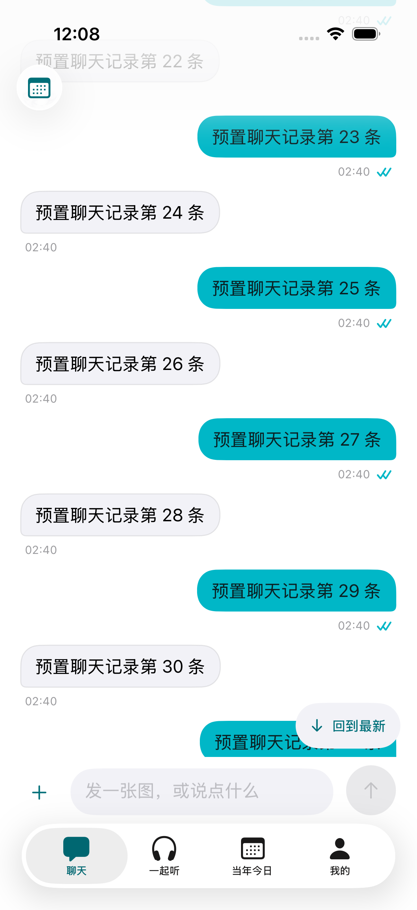
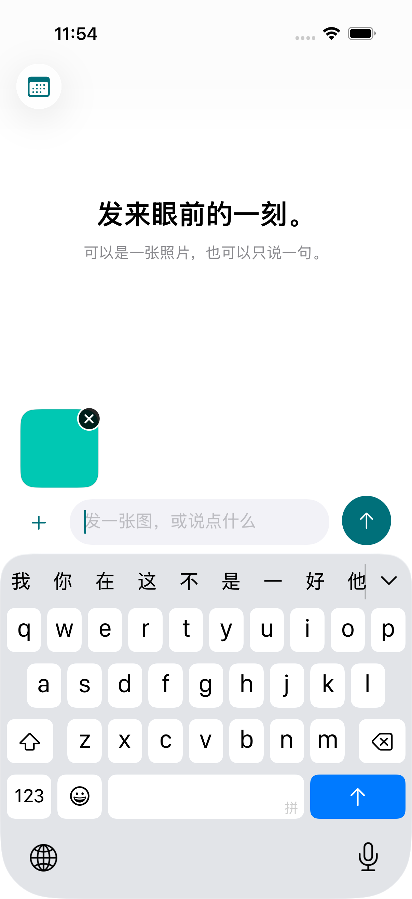
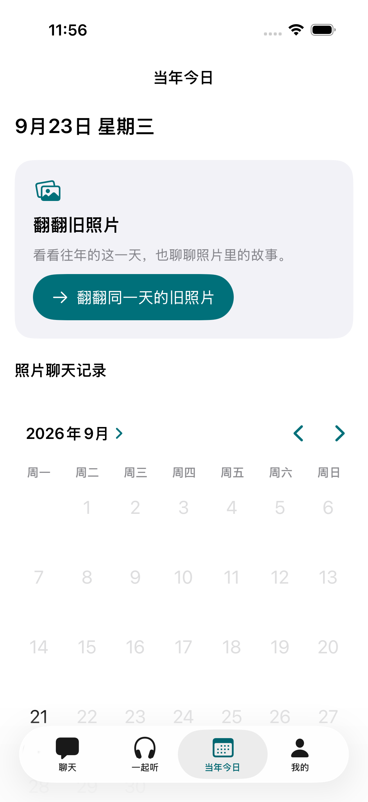
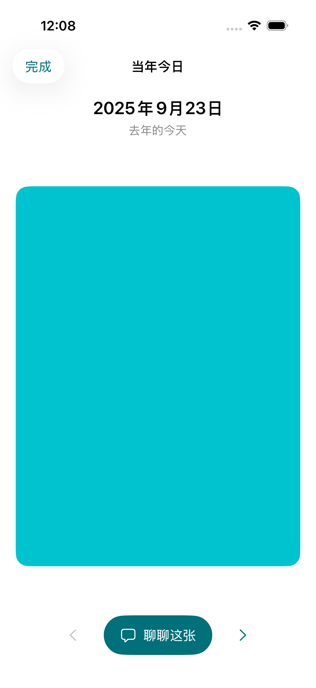
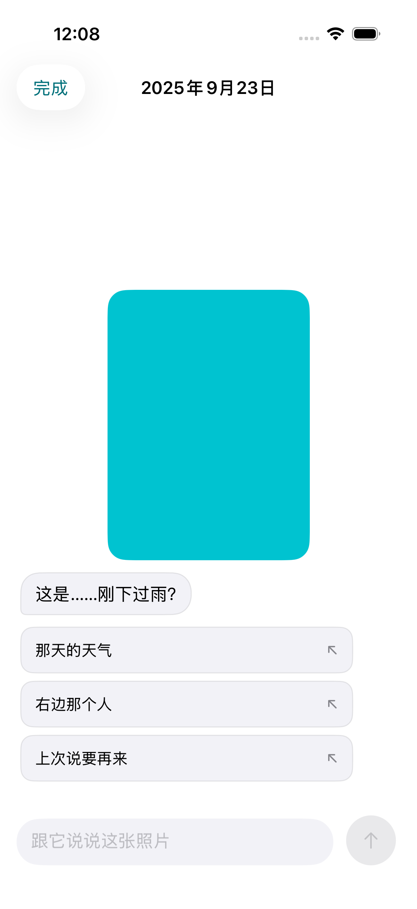
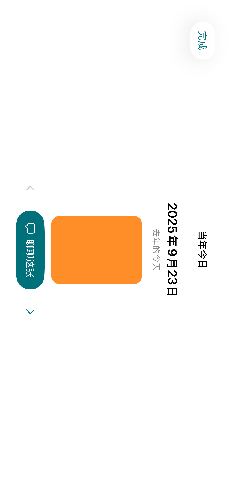
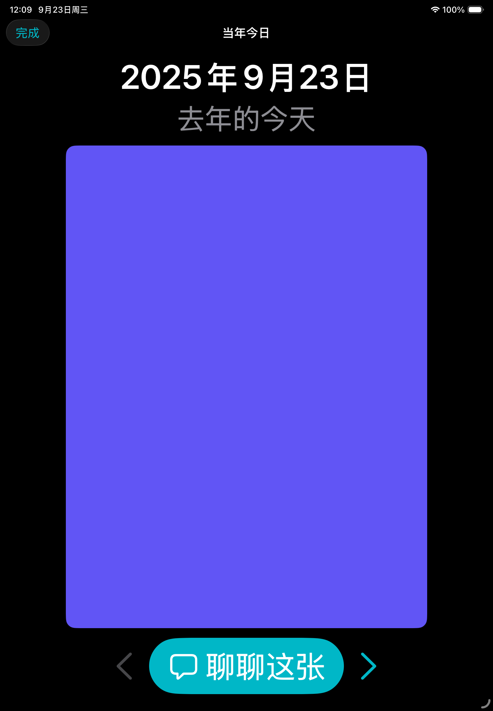
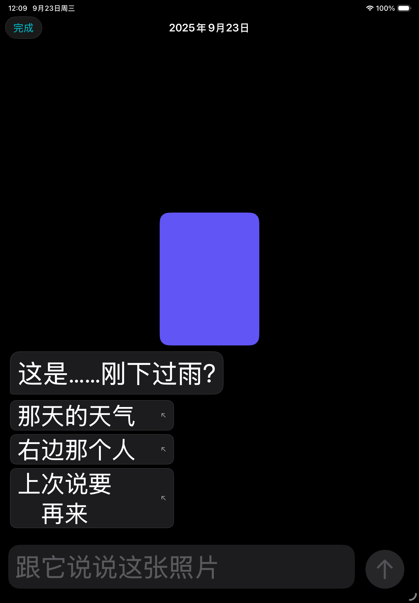
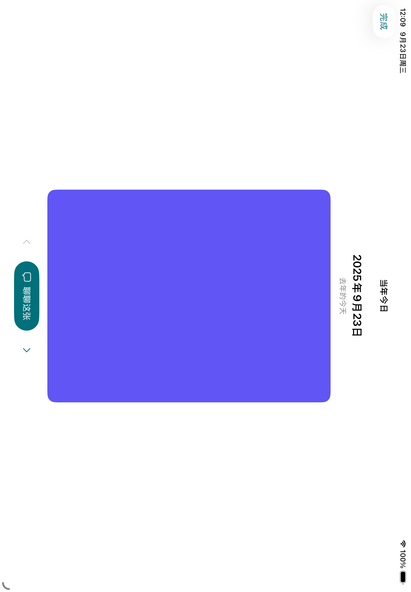

# 聊天与当年今日界面重构验收

> 状态：现状记录，审查后修订｜适用：iOS 客户端｜核验：2026-09-26｜依据：PR #37 首个提交的 Xcode 测试，以及审查修订后的构建与测试结果；不代表生产验收

## 行为变化

- 聊天移除标题和外层裁切，左上角是按日期查看的日历入口；消息在系统导航区域下连续滚动。
- 普通聊天、照片房间、存档续聊共用输入组件，业务模型与数据位置保持独立。附件进入底部安全区，不再依赖列表内固定照片占位。
- 回到最新只在日期跳转或载入旧记录后出现，按钮位于附件及发送栏之上；普通上滑不冻结对话。
- 当年今日首页先显示日期与浏览入口，再显示存档日历。照片左右翻页，可返回上一张，点击“聊聊这张”才创建房间。
- 日期、来源与可发送图片保持对应；加载失败可重试，过期图片结果不可替换当前选择。界面缓存最多保留相邻三张已加载图片。
- 照片浏览与房间共享导航容器和关闭按钮，内容短淡入；最大辅助字号明确传递至全屏页面。
- 删除无调用的 MurmurDisc、MurmurFloatingDisc、MurmurNotice，以及多余按钮样式包装、旧上下滑手势和重复输入栏布局。

## PR 范围

本 PR 从主线独立整理，包含原生导航、SQLite 日期分页与聊天日历，以及聊天／旧照界面重构。排除邮箱注册、账号管理扩展、跨设备同步、服务端实现和其他未提交工作。每日回顾客户端在审查后移出本 PR，改为单独的草稿 PR，与服务端一起评审。

下面的 215 项单元测试、32／4 项界面测试及截图来自拆分前的集成工作区，不能替代独立 PR 分支结果。该集成版本后来已在用户 iPhone 17 完成签名构建、覆盖安装和启动，未进行完整真机交互验收。

## 独立 PR 分支验证

- 从 `origin/main` 的 `0e6697f` 整理；排除账号同步后重新构建成功。
- 212 项单元测试全部通过（移除了不属于本 PR 的 3 项同步测试）。
- 6 项定向 UI 回归全部通过：历史存档续聊、日历跳转／回到最新、每日回顾问答／记忆修改（已随回顾客户端移出）、照片草稿与键盘、浅深色／大字号／横屏布局、旧照左右翻页／进入房间。
- 测试二进制之后恢复设置页本机记录文案并再次 build-for-testing 成功。设备数量说明当时仍是账号措辞，审查后已恢复为 main 上的设备码文案。
- 仓库检查与 `git diff --check` 通过。独立分支未重新安装用户手机。
- 当时的结果包与日志只留在作者本机的临时目录，没有入库，其他人无法复核；以正式 CI 为准。

## 检查与边界

| 检查 | 结果 |
| --- | --- |
| Murmur scheme 构建（build-for-testing） | 通过 |
| MurmurTests | 215 项通过，包含新增分页缓存、异步乱序及失败重试测试 |
| iPhone 相关 UI 回归 | 32 个不同用例的最终结果通过，包含失败修正后的定向重跑 |
| iPad 相关 UI 回归 | 4 个不同用例的最终结果通过 |
| 最后一次操作栏布局修正 | iPhone 3 项、iPad 1 项定向回归最终通过 |
| 仓库检查与 diff 空白检查 | 通过 |
| 实际截图检查 | iPhone／iPad、竖屏／横屏、浅色／深色、最大辅助字号及减少动态效果配置 |

所有 UI 用例使用 fake API 与临时存储，截图里的消息和色块照片均为测试数据。上述数量按用例去重，不代表全量 UI 套件或正式 CI 一次性通过。单元测试在最后一次照片操作栏布局微调前通过；微调后重新构建并运行受影响的界面用例。

本轮发现并修复全屏页面未继承测试大字号，以及照片操作按钮在大字号／横屏下超出可视区域的问题。测试同时修正 44 点尺寸的浮点精度误判与 iPad 原生标签重复无障碍节点查询。最后一轮关闭照片浏览用例曾在应用启动后找不到首页标签，未进入照片流程；相同二进制单独重跑通过，保留这一启动时序波动记录。

上述结果包同样只在作者本机临时目录，没有入库。

只检查本机 iOS 26.5 模拟器；iOS 18 实机、真实相册与 iCloud 下载、真机中文输入法、正式 CI 和生产环境不在本轮验收证据内。最低部署版本仍为 iOS 18。额外的小屏 SE 模拟器因首次数据迁移停滞而中止，未计入覆盖（原记录未说明停住的是模拟器自身的首次启动迁移，还是 App 的 JSON→SQLite 导入；导入逻辑已在审查后修订，见下文）；VoiceOver 已检查标签及点击区域，未进行真人听读验收。没有生产部署或分发打包；集成版真机安装情况见上文，已有未提交工作保留。

## 审查后修订（2026-09-24）

[PR #37 审查](https://github.com/fengfe1125/Murmur/pull/37#issuecomment-5791082623) 之后的行为修订：

- 上滑不再把对话冻结成快照；只有日期跳转和载入旧记录才进入阅读窗口，已到最新一条的窗口继续接收新消息。
- 旧 JSON 导入：同一 ID 重复时保留后一条；无法解码的文件原样另存为 `transcript.unreadable.json`；清空不再依赖导入，读取失败时清空按钮仍可用。
- 临时原图只在这张图自己的本机复制失败时保留，房间关闭后由存档接管，重试成功或清空时删除。
- 日期索引只在新的一天、新照片或撤回时重算。
- 删除账号在服务端成功后必定退出本机登记，本机清空失败会提示；清空聊天在清空成功后才取消进行中的发送。
- 纯歌曲回复不再判为“安静”；网易云搜索打开即聚焦，Audius 搜索关闭自动纠错。

修订后的验证（2026-09-26，Xcode 27.0，本机 iOS 26.5 模拟器）：

- `MurmurTests` 223 项全部通过。
- iPhone 17 上 22 个定向 UI 回归全部通过，覆盖上滑时收到回复、聊天日历、照片浏览与房间、存档续聊、原生标签页、深色大字号和横屏；iPad Pro 11-inch (M5) 上 4 个用例通过。
- 首轮 UI 运行中有两个用例找不到底部标签：标识符挂在 `.tabItem` 的 Label 上时，部分启动里不会出现在标签栏按钮上。四个标签已改用 iOS 18 的 `Tab` 声明并在其上设置标识符，界面不变；这两个用例随后各连跑 5 次均通过。

结果包保存在本机开发盘的工作目录，没有入库。iOS 18、真机与正式 CI 仍未验证。上面“检查与边界”中的数字与截图来自修订前的提交。

## 界面截图

### 聊天顶部与键盘

### 当年今日与照片房间

### iPhone 最大辅助字号与横屏

### iPad 最大辅助字号与横屏

